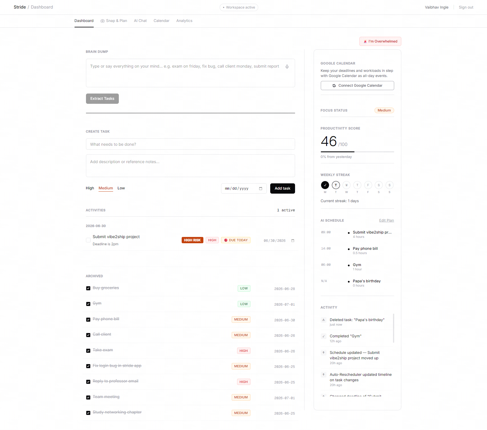
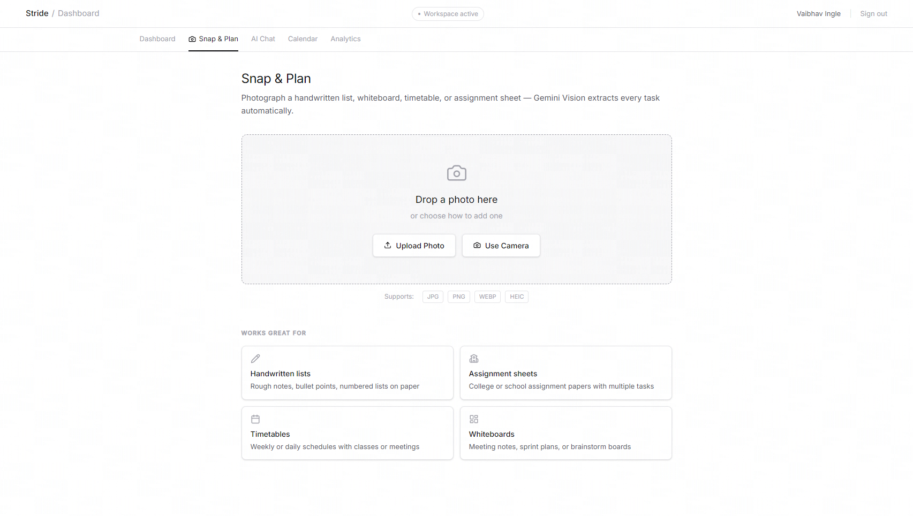
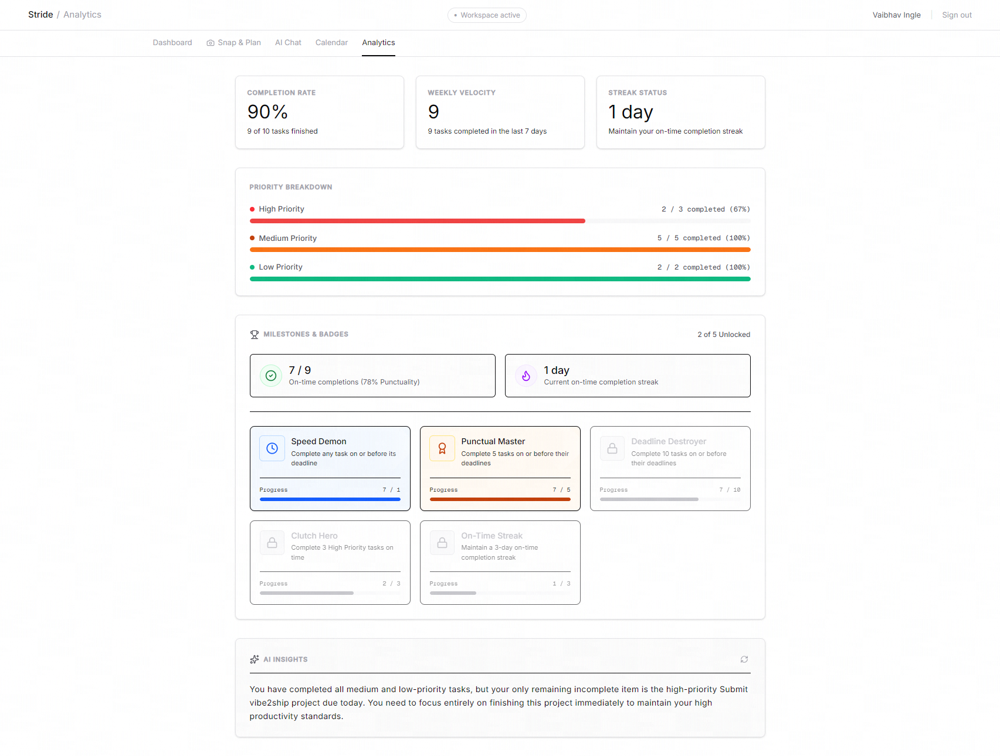

# Stride — the productivity tool that thinks ahead.

> Stop *managing* tasks. Start *finishing* them.

Stride is a full-stack AI productivity companion built on **Google Gemini**. Tell it what's on your mind — by typing, snapping a photo, or speaking — and it extracts your tasks, prioritizes them, builds a realistic daily schedule, and keeps adapting as your day changes.

Built for the **Vibe2Ship Hackathon** with React 19, Express, Firebase, and Gemini 3.1 Flash Lite.



---

## The problem

Deadlines don't slip because people are lazy — they slip because people spend their energy *organizing* work instead of *doing* it. Every to-do app gives you another list to maintain. None of them tell you the one thing to do **right now**.

## How Stride solves it

Stride runs a multi-step AI loop instead of a static list: it **extracts** tasks from raw input, **prioritizes** them by real urgency, **schedules** your day, **reschedules** automatically the moment anything changes, **rebalances** overloaded days, and **coaches** you in plain language. The result is a planner that makes the decision for you — "start here" — and quietly re-plans in the background while you work.

---

## Features

**AI Planning**
- **Brain Dump** — paste a messy stream of thought; Gemini turns it into structured tasks with inferred deadlines and priorities (`/api/extract`).
- **Snap & Plan** — photograph a whiteboard, syllabus, or handwritten list; Gemini Vision extracts every task (`/api/snap`).
- **AI Analyze** — one click returns *Do This Now*, a priority order with reasons, and a realistic time-blocked schedule (`/api/analyze`).
- **Auto-Reschedule** — silently rebuilds the plan whenever a task is added, completed, or moved (`/api/reschedule`).
- **Overload Rebalance** — when 3+ high-priority tasks land on one day, Gemini picks which to move (`/api/rebalance`).
- **I'm Overwhelmed** — a one-tap triage that cuts your workload to *start here*, *the 3 that matter*, and *safe to defer* (`/api/overwhelmed`).
- **Focus Mode** — per-task Pomodoro timer with AI-generated first steps and a risk explanation (`/api/focus-steps`, `/api/risk-explanation`).

**Gamification**
- **Productivity Score** — a live 0–100 score from daily completions, streak, and on-time high-priority work; resets daily.
- **Streaks & Badges** — weekly streak grid and milestone badges (Speed Demon, Punctual Master, Deadline Destroyer…) unlocked by finishing on time.
- **Completion confetti** — a burst fires when you check off a high-priority task.

**Calendar**
- **Google Calendar 2-way sync** — tasks become all-day events with priority colors and tiered reminders; OAuth2 with server-side refresh tokens (`/api/calendar/*`).
- **Monthly calendar view** — see every deadline at a glance and add tasks on any date.

**Coaching & Insight**
- **AI Chat Coach** — ask "Am I going to finish before Friday?"; Gemini answers with full context of your tasks (`/api/chat`).
- **Analytics insight** — one specific, data-grounded productivity tip (`/api/insight`).
- **Smart Nudges** — context-aware banners that push you from planning to doing.

---

## What's technically novel

- **Server-side Gemini proxy** — the API key never touches the client; all 15 AI routes run through Express.
- **Resilient model layer** — every call goes through a fallback helper with exponential-backoff retries on 429/503 and automatic model handoff, so high demand degrades gracefully instead of failing.
- **Agentic reschedule** — task mutations in Firestore trigger a debounced background re-plan; the schedule is never stale.
- **Structured-JSON outputs** — prompts force `application/json`, with a defensive extractor that survives markdown fences and stray prose.

---

## Tech stack


---

## Run locally

**Prerequisites:** Node.js 18+

```bash
# 1. Install dependencies
npm install

# 2. Add your Gemini API key to .env
echo 'GEMINI_API_KEY="your_key_here"' > .env

# 3. Start (Express + Vite on one port)
npm run dev      # → http://localhost:3000
```

Optional — Google Calendar sync needs three more vars in `.env` (`GOOGLE_CLIENT_ID`, `GOOGLE_CLIENT_SECRET`, `GOOGLE_OAUTH_REDIRECT_URI`); see `.env.example`.

```bash
npm run lint     # type-check (tsc --noEmit)
npm test         # unit tests (vitest)
npm run build    # production bundle
```

---

## Screenshots

| Dashboard | Snap & Plan | Analytics |
|---|---|---|
|  |  |  |

---

Built with Gemini · © 2026 Stride
